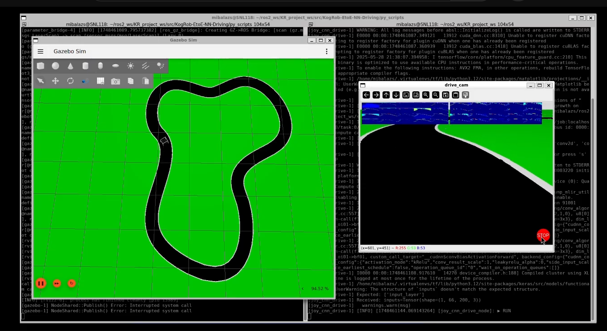

# KogRob: Robot control with end-to-end neural network
 
This project aims to implement a turtlebot3 driven by a CNN which reads images of the robot's camera, and outputs velocity commands to control the turtlebot3.
The foundation of the concepts and the network architecture was [this](https://developer.nvidia.com/blog/deep-learning-self-driving-cars/) NVIDIA project.
For this project ROS2 Jazzy and Gazebo Harmonic were used.

Created by:
- Miklós Balázs
- Kristóf Bányi
- Ádám Szakmári
- Barnabás Nyuli


The result of the project can be found in this video:

<a href="https://youtu.be/c5XmolrfNCw"></a> 


## 1. Install and setup

For use please install ROS2 Jazzy desktop version and Gazebo Harmonic.


Dependencies (beyond ROS2 and Gazebo):
- MOGI TurtleBot3 repositories
- Python3
- Some python packages:
    - TensorFlow (v2.18.0)
    - NumPy (v1.26.4)
    - imutils
    - Scikit-learn
    - Opencv-python
    - Matplotlib
- ROS2 joystick interface package

You can add these with cloning the following repositories into the src folder of the workspace:

```bash
git clone -b mogi-ros2 https://github.com/MOGI-ROS/turtlebot3
git clone -b new_gazebo https://github.com/MOGI-ROS/turtlebot3_simulations
```

And installing the packages below using apt:
```bash
sudo apt install python3-pip
sudo apt install pipx
sudo apt install ros-jazzy-joy-linux
sudo apt install ros-jazzy-teleop-twist-joy
sudo apt install ros-jazzy-message-filters
```

Set up a Python virtual environment, as described [here](https://github.com/MOGI-ROS/Week-1-8-Cognitive-robotics?tab=readme-ov-file#line-following)
and afterwards install these python packages:
```bash
pip install tensorflow==2.18.0
pip install imutils
pip install scikit-learn
pip install opencv-python
pip install matplotlib
pip install numpy==1.26.4
```

Because the CNN training is a standalone python script (not a ROS2 node), it is necessary to make it executable, by navigating to the ```py_scripts``` directory within the package and running the following command:
```bash
chmod +x create_and_train_cnn.py
```

Also don't forget to source the setup (workspace path may be different):

```bash
source ~/ros2_project/install/setup.bash
```
You should also set the environment variable for the TurtleBot3 Burger model:

```bash
export TURTLEBOT3_MODEL=burger
```

For GPU accelerated training process CUDA and cuDNN Library are required (optional).

Finally, after installing all dependencies, run the ```colcon build``` command in the root of the workspace.


## 2. How to use


### Controller
Manual control of the TurtleBot3 with joystick can be started using the launch file:
```bash
ros2 launch KogRob-EtoE-NN-Driving joy_teleop_manual.launch.py
```
This converts the /joy topic of the controller into twist messages in the /cmd_vel topic, so it can drive the robot. It also publishes a simple version of the /joy topic, called /joy_xy. This topic only contains a list of the x and y coordinates of the joystick. The range of the coordinates is from -1.0 to 1.0. The /joy_xy topic makes it easier to communicate with the neural network. Publishing this topic when manually driving helps with labeling in the teaching process.\
You can also drive the robot straight from the /joy_xy topic with the launch file:
```bash
ros2 launch KogRob-EtoE-NN-Driving joy_teleop.launch.py
```
This launch file converts the coordinates in the topic to joy and the twist values and publishes it in /cmd_vel. You can also configure both the joystick teleops in ```config/teleop_joy.yaml```. This file configures mainly the speed of the robot and the joystick selection.\
You can test the control of the robot with the prepared worlds in the ```turtlebot3_gazebo``` package from the ```turtlebot3_simulations``` repository. An example of a test world and the TurtleBot3:
```bash
ros2 launch turtlebot3_gazebo turtlebot3_house.launch.py
```

### Labeled data acquisition

To collect training data, recorded images paired with the corresponding joystick commands are saved. The `image_recorder` node is responsible for doing so. 

This node subscribes to the `/image_raw/compressed` topic (from the camera) and the `/joy_xy` topic (from the `joy_teleop_manual.launch.py` or a similar source).
When recording is active, the node receives images (downsampled to 10 FPS) and velocity commands in queues and pairs the closest ones together based on their arrival of the messages (ROS time).
If there are no velocity command matches for an image within a specified time, the image will not be saved. 
Also images will only be saved only if either the X or Y joystick value (or both) is non-zero to avoid saving images when the robot is stationary.

The training images are saved under the `labelled_data` folder within the package with a name similar to this: `20250521_201012_401_Xn0p500_Y0p860.jpg`
Here the first part shows the record date and time when the image was captured, and the numbers after `X` and `Y` represent the normalized angular (left-right) and linear (forward-backward) speed.
For easy file handling, the `.` and `-` symbols are exchanged for `p` and `n`. So in the example above an image was captured with `X: -0.500` and `Y: 0.860` values received on the joystick's topic.

The node can be started by running the following command:

```bash
ros2 run KogRob-EtoE-NN-Driving image_recorder
```
You can control the recording by:
*   Press the `r` key in the terminal where `image_recorder` is running to **start** recording.
*   Press `r` again to **stop** recording. You can toggle recording on and off as needed while driving the robot.
*   Press `q` or `Ctrl+C` to **quit** the recorder node gracefully.


The ```image_recorder``` node can be used in an altered mode, when listening to the ```\cmd_vel``` topic instead of ```\joy_xy``` . It is intended for testing and debug purposes only:
```bash
ros2 run KogRob-EtoE-NN-Driving image_recorder --ros-args -p use_cmd_vel:=True
```

### Neural network creation and teaching

The origin of the CNN model is NVIDIA's [DAVE-2](https://developer.nvidia.com/blog/deep-learning-self-driving-cars/), with the slight modification of outputting linear and angular speed, instead of giving only the reciprocal of the turning radius.
The network has an input of 200x66 pixels and X and Y outputs.


The network structure is as follows:

```bash
┏━━━━━━━━━━━━━━━━━━━━━━━━━━━━━━━━━┳━━━━━━━━━━━━━━━━━━━━━━━━┳━━━━━━━━━━━━━━━┓
┃ Layer (type)                    ┃ Output Shape           ┃       Param   ┃
┡━━━━━━━━━━━━━━━━━━━━━━━━━━━━━━━━━╇━━━━━━━━━━━━━━━━━━━━━━━━╇━━━━━━━━━━━━━━━┩
│ layer_normalization             │ (None, 66, 200, 3)     │             6 │
│ (LayerNormalization)            │                        │               │
├─────────────────────────────────┼────────────────────────┼───────────────┤
│ conv2d (Conv2D)                 │ (None, 31, 98, 24)     │         1,824 │
├─────────────────────────────────┼────────────────────────┼───────────────┤
│ dropout (Dropout)               │ (None, 31, 98, 24)     │             0 │
├─────────────────────────────────┼────────────────────────┼───────────────┤
│ conv2d_1 (Conv2D)               │ (None, 14, 47, 36)     │        21,636 │
├─────────────────────────────────┼────────────────────────┼───────────────┤
│ dropout_1 (Dropout)             │ (None, 14, 47, 36)     │             0 │
├─────────────────────────────────┼────────────────────────┼───────────────┤
│ conv2d_2 (Conv2D)               │ (None, 5, 22, 48)      │        43,248 │
├─────────────────────────────────┼────────────────────────┼───────────────┤
│ dropout_2 (Dropout)             │ (None, 5, 22, 48)      │             0 │
├─────────────────────────────────┼────────────────────────┼───────────────┤
│ conv2d_3 (Conv2D)               │ (None, 3, 20, 64)      │        27,712 │
├─────────────────────────────────┼────────────────────────┼───────────────┤
│ dropout_3 (Dropout)             │ (None, 3, 20, 64)      │             0 │
├─────────────────────────────────┼────────────────────────┼───────────────┤
│ conv2d_4 (Conv2D)               │ (None, 1, 18, 64)      │        36,928 │
├─────────────────────────────────┼────────────────────────┼───────────────┤
│ dropout_4 (Dropout)             │ (None, 1, 18, 64)      │             0 │
├─────────────────────────────────┼────────────────────────┼───────────────┤
│ flatten (Flatten)               │ (None, 1152)           │             0 │
├─────────────────────────────────┼────────────────────────┼───────────────┤
│ dense (Dense)                   │ (None, 100)            │       115,300 │
├─────────────────────────────────┼────────────────────────┼───────────────┤
│ activation (Activation)         │ (None, 100)            │             0 │
├─────────────────────────────────┼────────────────────────┼───────────────┤
│ dropout_5 (Dropout)             │ (None, 100)            │             0 │
├─────────────────────────────────┼────────────────────────┼───────────────┤
│ dense_1 (Dense)                 │ (None, 50)             │         5,050 │
├─────────────────────────────────┼────────────────────────┼───────────────┤
│ activation_1 (Activation)       │ (None, 50)             │             0 │
├─────────────────────────────────┼────────────────────────┼───────────────┤
│ dropout_6 (Dropout)             │ (None, 50)             │             0 │
├─────────────────────────────────┼────────────────────────┼───────────────┤
│ dense_2 (Dense)                 │ (None, 10)             │           510 │
├─────────────────────────────────┼────────────────────────┼───────────────┤
│ activation_2 (Activation)       │ (None, 10)             │             0 │
├─────────────────────────────────┼────────────────────────┼───────────────┤
│ dropout_7 (Dropout)             │ (None, 10)             │             0 │
├─────────────────────────────────┼────────────────────────┼───────────────┤
│ dense_3 (Dense)                 │ (None, 2)              │            22 │
└─────────────────────────────────┴────────────────────────┴───────────────┘
 Total params: 252,236 (985.30 KB)
 Trainable params: 252,236 (985.30 KB)
 Non-trainable params: 0 (0.00 B)


```

If a correctly labelled training dataset exists in the directory mentioned above, the CNN can be created and trained by navigating to the `py_scripts` directory and running the script:

```bash
python3 create_and_train_cnn.py
```
The process can be monitored in the terminal, and in case an error happens it is also printed here.

The script first prints the TensorFlow/Keras version and checks for an available CUDA-capable GPU. If there is, dynamic memory-growth is enabled, otherwise the process automatically falls back to CPU.

#### Data discovery

The script is looking for labeled images in the above-mentioned `<package>/labelled_data`  folder and its subfolders in `.jpg` or `.png` format.
(Names must embed joystick values, e.g. `...X0p40_Y0p25.jpg`!)


#### Image processing

To balance the dataset the script divides steering angles into 21 equal-width bins, where each image is assigned. A maximum of 400 images are retained in each bin to prevent over-representation of certain steering angles. If limit the is reached, a random subset is selected.

For further balance of the dataset, a flipping augmentation is applied. This duplicates the dataset by flipping images horizontally and inverting their steering parameter. The dataset is then shuffled to avoiding ordering bias. This augmentation can be turned off by toggling `DO_FLIP = True` to `False`. This method alone can be tested with running:
```bash
ros2 run KogRob-EtoE-NN-Driving test_flip
```
The node selects picture and flips it, then saves it along with the original with `_original` and `_test` in their names, while printing the original and flipped labels in the terminal.


#### Training

After loading and balancing the full image set the data is converted into NumPy array and split 75% / 25% for training and testing.

The script is training only `X` parameters (for steering) by default, but a two output mode is available by setting `LEARN_MODE = 'xy'`. In this mode the model is learning speed control also, though this mode is not yet implemented in the driving node.

##### Hyperparameters

```

| Parameter       | Default Value | Description                                         |
|-----------------|---------------|-----------------------------------------------------|
| EPOCHS          | 50            | Upper bound, Early-Stopping might be called earlier |
| BATCH_SIZE      | 32            | Batch size                                          |
| LEARNING_RATE   | 3x10^-4       | Adam optimizer step size                            |
| DROPOUT_RATE    | 0.1           | Applied after every Conv & FC layer                 |

```

The model is compiled for regression: 
`model.compile(loss="mse", optimizer=Adam(learning_rate=LEARNING_RATE), metrics=["mae", "mse"])`

 ##### Callbacks

 ```

| Callback          | Monitored Value | Role                                        |
|-------------------|------------------|--------------------------------------------|
| ReduceLROnPlateau | val_mae          | Halve LR after 5 stagnant epochs           |
| EarlyStopping     | val_mae          | Stop after 10 stagnant epochs              |
| ModelCheckpoint   | val_mae          | Persist only the best model in every step  |

 ```


Consequently two artefacts are written to `network_model/`:

`best_model.keras` – updated only when the current epoch beats the previous best on `val_mae`.

`last_model.keras` – snapshot from the last epoch, even if it is worse. 

#### Evaluation

When training stops the script reloads `best_model.keras` and computes test-set Loss / MAE / MSE and pops up two plots
- Training history: train vs. validation loss/MAE across epochs
- Prediction vs. Ground-truth - sorted curve for visualising errors on the specific steering predictions

### Applying the trained neural network

Once `best_model.keras` is saved in `network_model/` we can hand over the wheel to the CNN with the `joy_cnn_drive` actuator node.

This node opens a window with the camera feed and reads our `best_model.keras` file by default. In the window we see the camera feed and two tiles of smaller pictures of the first two Conv-layer activation maps. There is a Start/Stop button in the bottom right corner, which toggles `constant_speed` between `0` and `0.2 m/s`. This can also controlled by pressing `s` button.

The node sends `[x, y]` velocties as `Float32MultiArray` on `/joy_xy` every frame.

#### Gazebo quick-start

With the following command you can launch Gazebo with the TurtleBot3 on a track (default world: `track_with_road.sdf`) and RVIZ:

```bash
`ros2 launch KogRob-EtoE-NN-Driving simulation_bringup_track_follow.launch.py`
```


#### For a wired up CNN control 

In a second terminal window run:

```bash
`ros2 launch KogRob-EtoE-NN-Driving joy_cnn_drive.launch.py`
```

This launch file starts `joy_cnn_drive`, `joy_xy_republisher` and `teleop_twist_joy` nodes, so the CNN can drive with the same config we used for manual driving.

Click `RUN` and the robot should start - controlled by the CNN.